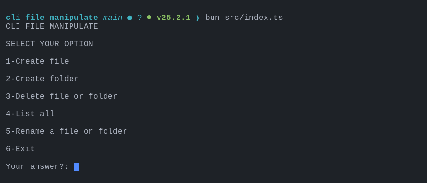

# cli-file-manipulate

A CLI(Command Line Interface) built with TypeScript and Bun
for file system manipulation directly from the terminal

## Features

- Create files and folders
- Delete files and folders
- Rename files and folders
- List directory contents

## ScreenShot



## Requirements

#### Install Bun

Installation Bun Commands

macOS / Linux

```
curl -fsSL https://bun.sh/install | bash
```

Windows(PowerShell)

```
powershell -c "irm bun.sh/install.ps1 | iex"
```

NPM(Global)

```
npm install -g bun
```

## Run

```
# clone the repository
git clone https://github.com/phangelim/cli-file-manipulate

# enter in the directory
cd cli-file-manipulate

# install the dependency
bun install

# run the project
bun src/index.ts
```
